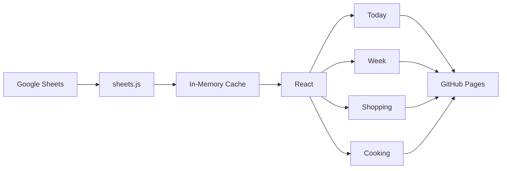
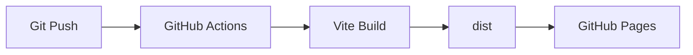

<div align="center">

# 🍽️ My Food Plan

**A personal meal planner that turns a Google Sheet into a readable, responsive web app.**

### [ ▶ See Live Demo ](https://anjiladhikari.github.io/food/)

<br>


</div>

---

## What is this?

A personal meal-planning app. The full food plan lives in a Google Sheet, and this frontend reads it directly and presents it as four views — **Today**, **Week**, **Shopping** and **Cooking** — designed to be comfortable on a phone and on a desktop.

There is no backend and no database: the sheet *is* the data.

---

## Features

| View | Purpose |
| --- | --- |
| 📅 **Today** | Today's breakfast, lunch, dinner, nutrition & cost, with Next-day navigation |
| 🗓️ **Week** | Four aligned day columns at a glance — on mobile too |
| 🛒 **Shopping** | Recommended product per item, why it's picked, and a Woolworths link |
| 🍳 **Cooking** | Equipment, method and a tip for each food |

---

## How it works

```
Google Sheets → Data Fetching → React UI → GitHub Pages
```



### Data flow

1. Meal, shopping and cooking data are maintained in Google Sheets.
2. The frontend requests each sheet directly via the Google Visualization endpoint.
3. Each sheet is cached in memory and fetched **once per browser session**.
4. React components turn the rows into the four views.
5. Editing the sheet updates the app — no code changes, no redeploy.

---

## Architecture

```
src/
├── components/
│   ├── Navigation.jsx    tab bar
│   ├── MealCard.jsx      meal block (full + compact)
│   └── Footer.jsx
├── pages/
│   ├── Today.jsx
│   ├── Week.jsx
│   ├── Shopping.jsx
│   └── Cooking.jsx
├── lib/
│   └── sheets.js         fetching, caching, day helpers
├── App.jsx               active tab state + layout
├── main.jsx
└── index.css             Tailwind theme tokens (dark)
```

| Folder | Role |
| --- | --- |
| `components/` | Reusable UI |
| `pages/` | The four views |
| `lib/` | Google Sheets fetching and data utilities |
| `App.jsx` | Application state and navigation |
| `index.css` | Global Tailwind theme and design tokens |

State is plain React `useState` — no router, no store.

---

## Tech stack

| Layer | Choice |
| --- | --- |
| Frontend | React 19 |
| Build tool | Vite 7 |
| Styling | Tailwind CSS 4 |
| Data source | Google Sheets |
| Hosting | GitHub Pages (`/food/` base path) |
| CI/CD | GitHub Actions |

---

## Deployment



Every push to `main` builds the app and publishes `dist/` to GitHub Pages automatically.

---

## Local development

```bash
npm install
npm run dev
```

```bash
npm run build    # production build
```

---

<div align="center">

Built for making everyday meal planning simpler.

**[Geeky Anjil](https://anjiladhikari.com.np)**

</div>
